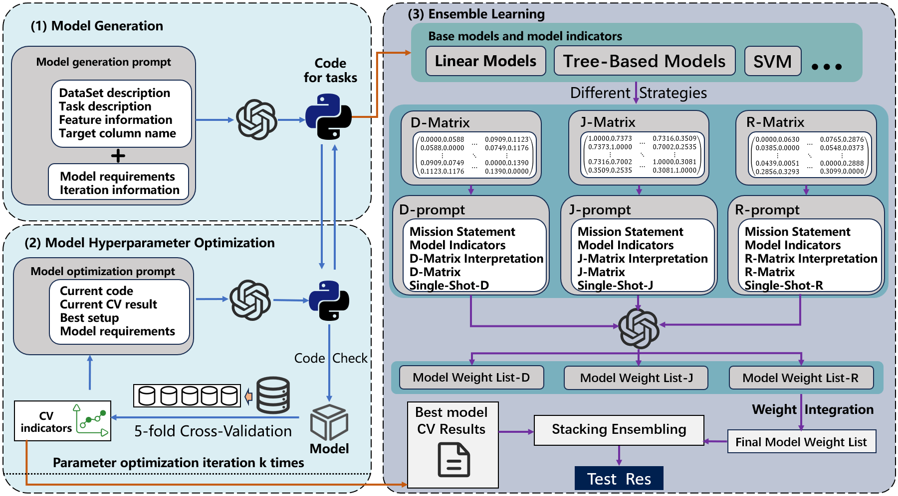

# BOLT: A Pipeline-Level Controller for Fast-and-Accurate AutoML
---

## 🚀 Quick Start
### Create Conda Environment and Install Dependencies
```bush
conda create -n bolt python=3.11.12
conda activate bolt
pip install -r requirements.txt
```

---

## 🧩 Overview
<p align="center">
  
</p>

**BOLT (Bounded-Overhead LLM-Tooled AutoML)** is a strategy-layer control framework that unifies **LLM-guided model generation**, **budget-aware hyperparameter optimization**, and **multi-strategy ensemble weighting**.  
It targets the persistent trade-off between **speed** and **accuracy** in real-world AutoML pipelines.

BOLT integrates large language models (LLMs) into the AutoML workflow to:
- Generate executable model code and hyperparameter configurations under fixed budgets.  
- Construct *diversity (D)*, *redundancy (J)*, and *rescue (R)* strategy matrices for ensemble weighting.  
- Fuse multiple weighting strategies into a unified stacking ensemble.

---

## ⚙️ Key Features

- **LLM-driven candidate generation** — Produces valid and diverse model code via structured prompts.
- **Budget-aware hyperparameter optimization** — Constrains search cost while maintaining model quality.
- **Plug-and-play strategy layer** — Provides training-free weighting modules (D/J/R) that improve complementarity.
- **Unified ensemble integration** — Combines strategy-specific weights using geometric pooling and shrinkage.

---

## 📊 Experimental Results

Across **30 public datasets** (classification and regression):
- BOLT consistently outperforms strong AutoML baselines (e.g., AutoGluon, TPOT, H2O, DS-Agent).
- Achieves **higher AUC under equal or shorter runtime budgets**.
- Ablation studies confirm the complementary benefits of D/J/R strategies.

---


